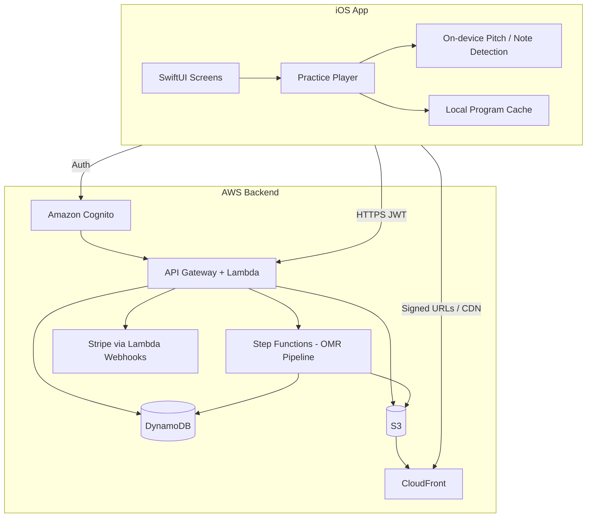
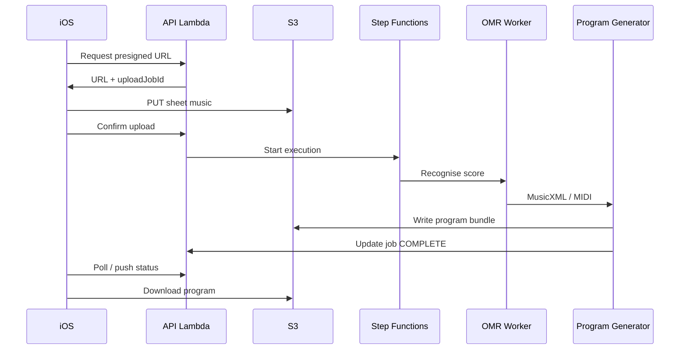
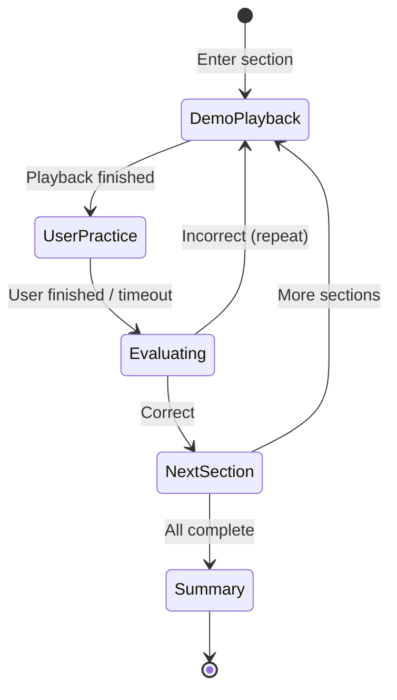

# Fingora Architecture

**Version:** 0.1 (scaffold)  
**Stack:** Native iOS (Swift/SwiftUI) + AWS serverless backend  
**PRD reference:** [PRD.md](./PRD.md)

---

## 1. System overview

Fingora is a client–server product: the **iOS app** handles practice UX, playback, and real-time note listening; the **AWS backend** handles accounts, catalog, payments, uploads, OMR/program generation, and entitlement to practice assets.



**Design principle:** keep **latency-sensitive practice loop** on the device (mic, highlights, section advance); keep **heavy, paid, async work** on the server (OMR, program packaging, purchases).

---

## 2. Major subsystems

| Subsystem | Responsibility | Primary location |
|-----------|----------------|------------------|
| Identity | Register, verify email, login, password reset | Cognito + thin profile in DynamoDB |
| Catalog | Browse/search/filter native programs | API + DynamoDB + S3 metadata |
| Commerce | Purchase programs & upload processing credits | Stripe + entitlements in DynamoDB |
| Upload & OMR | Ingest PDF/JPEG/PNG, async pipeline to MusicXML/MIDI/sections | S3 + Step Functions + workers |
| Programs | Canonical practice program JSON + assets | S3 (+ CloudFront) |
| My List & progress | Favourites, resume position, accuracy summaries | DynamoDB (+ optional local mirror on iOS) |
| Practice player | Section flow, playback, keyboard, fingering UI | iOS only |
| Listening | Correct/incorrect notes during practice | iOS (AudioKit or similar); server not in hot path |

---

## 3. AWS backend architecture

### 3.1 API surface

- **Amazon API Gateway (HTTP API)** in front of **AWS Lambda** functions, grouped by domain:
  - `users` — profile, credits
  - `catalog` — list/detail native programs
  - `library` — owned, My List, private generated programs
  - `uploads` — presigned upload, job status
  - `purchases` — checkout session, history
  - `progress` — section completion, aggregates

- **Auth:** Cognito User Pools; API Gateway JWT authorizer. No custom password storage in app code.

### 3.2 Data stores

| Store | Contents |
|-------|----------|
| **DynamoDB** | Users (profile), `Program`, `UserProgram`, `UploadJob`, `Purchase`, `MyListItem`, `PracticeProgress` |
| **S3** | Raw uploads, generated MusicXML/MIDI, section audio, packaged program bundles |
| **CloudFront** | Delivery of purchased/downloaded assets with signed URLs |

Single-table or multi-table DynamoDB is an implementation choice; MVP can start with **one table per aggregate** for clarity.

### 3.3 Upload & OMR pipeline (async)



Steps (MVP):

1. Validate payment/credits.
2. Store original in `uploads/{userId}/{jobId}/`.
3. OMR worker (container Lambda or ECS task if needed) → MusicXML + MIDI.
4. Program generator Lambda: slice into **sections**, attach fingering hints, render reference audio (or reference MIDI for on-device synth).
5. Persist `Program` record + manifest URL.

Failures: job status `FAILED` with reason; user can reprocess from Private Library (PRD §8.6).

### 3.4 Payments

- **Stripe Checkout / Payment Intents** created by Lambda; webhooks update `Purchase` and unlock `UserProgram` or deduct **upload credits**.
- iOS may use **StoreKit** later for IAP; MVP PRD specifies in-app purchase of programs and processing — Stripe keeps server entitlements straightforward for cross-platform later.

### 3.5 Observability & ops

- CloudWatch Logs (Lambda), X-Ray optional
- DLQ on async workers
- S3 lifecycle for failed/raw uploads

Infrastructure is defined as code under `backend/infrastructure/` (AWS CDK).

---

## 4. iOS app architecture

### 4.1 Pattern

- **SwiftUI** + **MVVM** per feature module
- **Composition root** in `App/` wires dependencies (API client, auth session, repositories)
- **Async/await** for network; **Combine** only where already idiomatic in Apple APIs

### 4.2 Feature modules (map to PRD screens)

| Module | Screens / capability |
|--------|----------------------|
| `Auth` | Welcome, register, login, verify, forgot password |
| `Home` | Continue, recommendations, featured |
| `Catalog` | Practice library, search, filters, program detail |
| `Upload` | Pick file, cost confirm, progress, processing status |
| `PrivateLibrary` | User-generated programs |
| `MyList` | Saved items, resume position |
| `PracticePlayer` | Sheet music, keyboard, hands, mic feedback, sections |
| `Progress` | Stats, streaks, accuracy |
| `Settings` | Account, purchases, storage, permissions |

### 4.3 Core layers

```
Presentation (Views + ViewModels)
    ↓
Domain (use cases, models)
    ↓
Data (API client, repositories, local cache)
```

- **APIClient:** Cognito token refresh + REST to API Gateway
- **ProgramCache:** downloaded bundles for offline practice (PRD §5.1)
- **AudioEngine:** section playback before user practice
- **PracticeEngine:** section state machine (demo → listen → evaluate → next/repeat)
- **PitchDetector:** microphone analysis; compares to expected notes from program manifest

### 4.4 Practice loop (on-device)



Expected notes and timing windows come from the **program manifest** (generated server-side, consumed offline after download).

---

## 5. Shared contracts

- **OpenAPI** (or JSON Schema) under `shared/api/` defines REST payloads aligned with PRD §9 data models.
- **Program manifest** versioned JSON: sections, measures, expected pitches, fingering, asset URLs.
- Version field on manifest for app backward compatibility.

---

## 6. Security & privacy

- Cognito for credentials; tokens in Keychain
- S3 presigned URLs, short TTL
- User uploads and generated programs scoped by `userId`
- Mic audio processed on-device; no raw audio upload in MVP unless explicitly added later
- Stripe PCI scope limited to Stripe-hosted flows

---

## 7. MVP build order (recommended)

1. Cognito + API skeleton + DynamoDB tables  
2. Catalog read APIs + iOS library/browse (mock player)  
3. Program manifest format + iOS practice player (local fixture)  
4. Mic evaluation + section state machine  
5. Stripe + entitlements + download  
6. Upload presign + OMR pipeline + private library  
7. My List, progress sync, polish  

---

## 8. Repository layout

See root [README.md](../README.md) and per-folder README files under `ios/`, `backend/`, and `shared/`.
